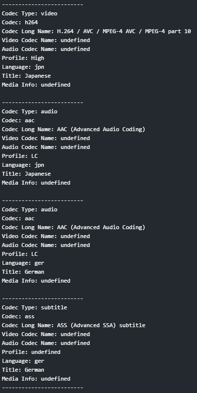
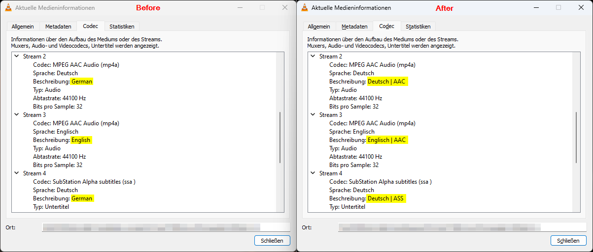

# Custom Tdarr Classic Plugins I made and use
Here are the custom plugins I've made for Tdarr. These plugins help with streamlining media processing, debugging, and organizing stream data.

## Tdarr_Classic_Plugin_Chasil_Print_Stream_Infos
This classic plugin prints out information about the different streams. The information can be shown in the report or logfile. I use it primarily for debugging purposes.

### Example output inside report


## Tdarr_Classic_Plugin_Chasil_Rename_Stream_Titles
This plugin renames the audio and subtitle stream titles for better organization and readability. It's especially useful for standardizing stream names across different files.

### Renaming Structure
The renaming follows a specific format based on the language and codec of each stream:

**Format:**  
`Language 'Additional Info (if applicable)' | Codec`

For example:
- `Deutsch | AAC`
- `Deutsch Forced | SRT`

### Settings:
- **rename_audio_streams**:  
  - *Type*: Boolean  
  - *Default*: `true`  
  - *Description*: Set to `true` to rename audio streams, otherwise set to `false`.
  
- **rename_subtitle_streams**:  
  - *Type*: Boolean  
  - *Default*: `true`  
  - *Description*: Set to `true` to rename subtitle streams, otherwise set to `false`.

### Current Limitation
The renaming currently happens in German only, meaning that stream titles are output in the German language. This could be an issue for users who are not familiar with German, as the renamed stream titles may not be easily readable. In future updates, other languages may be supported.

### Example before and after renaming



## Installation Guide

To install and use any of these Tdarr plugins, follow these steps:

1. **Download the Plugin**
   Clone the repository or download the specific branch for the plugin you want to use:
   ```
   git clone -b <plugin-branch-name> https://github.com/deso85/Tdarr-Classic-Plugins.git
   ```

2. **Add the Plugin to Tdarr**
   Copy the plugin file from the cloned repository to your Tdarr plugin folder, which is usually located at:
   ```
   /path/to/tdarr/server/Tdarr/Plugins/Local
   ```

3. **Check if the plugin is available in Tdarr**
   - Open Tdarr
   - Navigate to the **Classic Plugins** section to check if the plugin has been recognized

4. **Usage**
   - Go to the **Libraries** sectiom
   - Edit an existing library or create a new one
   - Go to **Transcoder Options** and add the Plugin via drag and drop from the plugins list on the right
   - Configure the plugin if possible by clicking on it
   
   You can alternatively add the plugin inside a Flow using the 'Run Classic Transcode/Filter Plugin' flow plugin.
   
   Tdarr will apply it during the transcoding or media processing tasks associated with that Library/Flow.