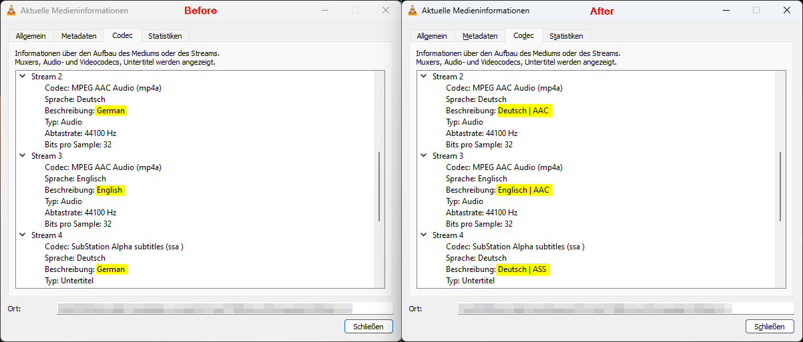

# Custom Tdarr Classic Plugins I made and use
Here are the custom plugins I've made for Tdarr. These plugins help with streamlining media processing, debugging, and organizing stream data.

## Tdarr_Classic_Plugin_Chasil_Print_Stream_Infos
This classic plugin prints out information about the different streams. The information can be shown in the report or logfile. I use it primarily for debugging purposes.

### Logged information per stream
- Codec type, name and long name
- Video/Audio codec name (when available)
- Profile
- Language and title
- Codec ID
- Commercial format name (e.g. "Dolby Digital Plus") via MediaInfo
- Channel layout (formatted, e.g. "2.0" instead of "stereo")
- Audio bitrate (kbps) or quality value as fallback

### Example output inside report


## Tdarr_Classic_Plugin_Chasil_Rename_Stream_Titles
This plugin renames the audio and subtitle stream titles for better organization and readability. It's especially useful for standardizing stream names across different files.

### Renaming Structure
The renaming follows a specific format based on the language and codec of each stream:

**Format:**  
`Language 'Additional Info (if applicable)' | Codec`

For example:
- `Deutsch | AAC`
- `Deutsch Forced | SRT`

### Settings:
- **rename_audio_streams**:
    - *Type*: Boolean
    - *Default*: `true`
    - *Description*: Set to `true` to rename audio streams, otherwise set to `false`.

- **rename_subtitle_streams**:
    - *Type*: Boolean
    - *Default*: `true`
    - *Description*: Set to `true` to rename subtitle streams, otherwise set to `false`.

### Current Limitation
The renaming currently happens in German only, meaning that stream titles are output in the German language. This could be an issue for users who are not familiar with German, as the renamed stream titles may not be easily readable. In future updates, other languages may be supported.

### Example before and after renaming



## Tdarr_Classic_Plugin_Chasil_Sort_Streams
This plugin sorts streams in a media file by type (video, audio, subtitle, chapter)
and a secondary criteria. The plugin helps to ensure a consistent and logical stream
order, improving accessibility and compatibility.

### Sorting Details
- **Video Streams**: Sorted by language (streams without a language tag are placed last).
- **Audio Streams**: Sorted by title (normalized — parentheses are removed,
  comparison is case-insensitive). Streams without a title are placed first.
- **Subtitle Streams**: Sorted by title (same normalization as audio).
- **Chapter Streams**: Not sorted individually, but appended after the other
  stream types.

### Behavior
- The plugin compares the current stream order with the desired order and
  **skips processing** if the file is already sorted correctly.
- When processing is needed, streams are remapped using FFmpeg stream copy
  (no re-encoding).
- The `bitexact` flags are set to avoid unnecessary metadata changes.

### Usage
This plugin requires no configuration. Simply add it to your library or flow
to ensure streams are ordered logically.

## Tdarr_Classic_Plugin_Chasil_Set_Disposition_Flags_From_Stream_Titles
This plugin parses audio and subtitle stream titles and sets matching disposition flags automatically. It detects keywords in both German and English and only re-encodes (stream copy) when flags are actually missing — leaving existing flags untouched.

### Supported Dispositions
| Disposition | Default Patterns (case-insensitive) |
|---|---|
| **forced** | `forced`, `erzwungen` |
| **comment** | `comment`, `kommentar` |
| **hearing_impaired** | `sdh`, `hearing.?impaired`, `hard.?of.?hearing`, `closed.?caption`, `hörgeschädigt`, `schwerhörig`, `\bcc\b` |
| **visual_impaired** | `visual.?impaired`, `audio.?desc`, `sehgeschädigt`, `audiodeskription`, `\bad\b`, `\badp?\b` |

### Settings
Each disposition has an optional input field for additional comma-separated regex patterns. Leave empty to use the defaults listed above.

- **forcedPatterns**: Additional patterns for the `forced` flag.
- **commentPatterns**: Additional patterns for the `comment` flag.
- **hearingImpairedPatterns**: Additional patterns for the `hearing_impaired` flag.
- **visualImpairedPatterns**: Additional patterns for the `visual_impaired` flag.

### How It Works
1. Scans all audio and subtitle streams for existing titles
2. Matches titles against the configured regex patterns
3. Compares detected dispositions with the currently set flags
4. Sets missing flags without removing any existing ones
5. Only triggers a transcode (stream copy) if at least one flag needs to be added

### Logging
The plugin provides detailed log output visible in the Tdarr file report:
- Active patterns per disposition
- Per-stream breakdown (skipped, no match, already set, or newly added flags)
- The resulting FFmpeg arguments for full transparency

## Installation Guide

To install and use any of these Tdarr plugins, follow these steps:

1. **Download the Plugin**
   Clone the repository or download the specific branch for the plugin you want to use:
   ```
   git clone -b <plugin-branch-name> https://github.com/deso85/Tdarr-Classic-Plugins.git
   ```

2. **Add the Plugin to Tdarr**
   Copy the plugin file from the cloned repository to your Tdarr plugin folder, which is usually located at:
   ```
   /path/to/tdarr/server/Tdarr/Plugins/Local
   ```

3. **Check if the plugin is available in Tdarr**
    - Open Tdarr
    - Navigate to the **Classic Plugins** section to check if the plugin has been recognized

4. **Usage**
    - Go to the **Libraries** section
    - Edit an existing library or create a new one
    - Go to **Transcoder Options** and add the Plugin via drag and drop from the plugins list on the right
    - Configure the plugin if possible by clicking on it

   You can alternatively add the plugin inside a Flow using the 'Run Classic Transcode/Filter Plugin' flow plugin.

   Tdarr will apply it during the transcoding or media processing tasks associated with that Library/Flow.