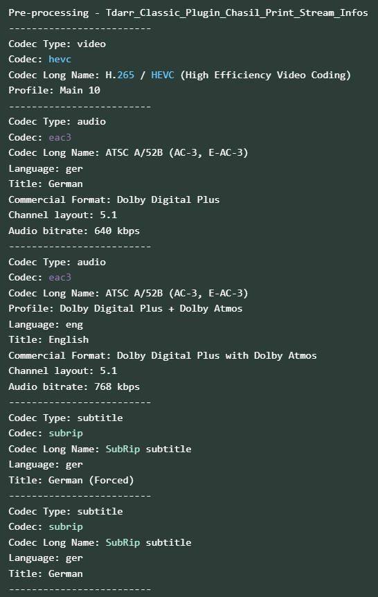
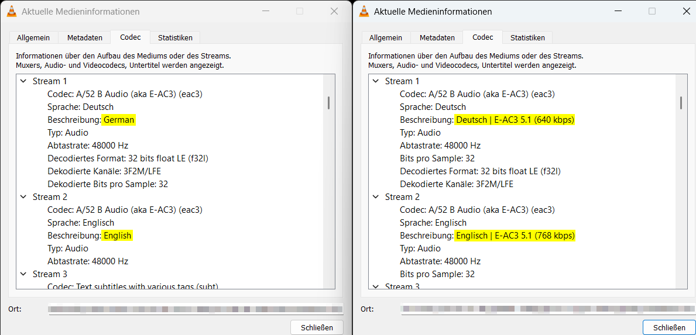

# Custom Tdarr Classic Plugins I made and use
Here are the custom plugins I've made for Tdarr. These plugins help with streamlining media processing, debugging, and organizing stream data.

Each plugin can be used independently, but they are most effective when combined in the right order. Below is my recommended plugin chain:

1. **Print Stream Infos** — Log stream details for debugging
2. **Change Stream Properties** — Clean up unwanted video/audio metadata and flags
3. **Filter Streams By Language** — Remove audio and subtitle streams not matching a language keep-list
4. **Set Disposition Flags from Stream Titles** — Automatically set disposition flags based on title patterns
5. **Rename Stream Titles** — Standardize audio and subtitle stream titles
6. **Sort Streams** — Order streams by type, title and language

> **Why this order?**
> Stream infos are printed first for a before-snapshot. Then video and audio properties are cleaned up. Next, unwanted audio and subtitle streams are removed by language so that subsequent plugins only process relevant streams. Disposition flags are then set based on titles. Titles are renamed afterwards so flag detection still works on the original titles. Finally, streams are sorted into a clean order.

---

## Tdarr_Classic_Plugin_Chasil_Print_Stream_Infos
This classic plugin prints out information about the different streams. The information can be shown in the report or logfile. I use it primarily for debugging purposes.

### Logged information per stream
- Codec type, name and long name
- Video/Audio codec name (when available)
- Profile
- Language and title
- Codec ID
- Commercial format name (e.g. "Dolby Digital Plus") via MediaInfo
- Channel layout (formatted, e.g. "2.0" instead of "stereo")
- Audio bitrate (kbps) or quality value as fallback

### Example output inside report


## Tdarr_Classic_Plugin_Chasil_Change_Stream_Properties

This plugin removes unwanted metadata and flags from video and audio streams,
including the overall file title, video stream titles, video stream languages,
the forced disposition flag on video streams, and the forced disposition flag on
audio streams. It only triggers a transcode (stream copy, no re-encoding) when
at least one property actually needs to be changed.

### Settings

| Setting | Type | Default | Description |
|---|---|---|---|
| `remove_title` | Boolean | `true` | Remove the overall file metadata title if it is set. |
| `remove_video_title` | Boolean | `true` | Remove the title tag from video streams if set. |
| `remove_video_language` | Boolean | `true` | Remove the language tag from video streams if set. |
| `remove_video_forced_flag` | Boolean | `true` | Remove the forced disposition flag from video streams if set. |
| `remove_audio_forced_flag` | Boolean | `true` | Remove the forced disposition flag from audio streams if set. |

### Behavior

- The plugin checks whether the file is a video; non-video files are skipped.
- Each option is evaluated independently — only the enabled checks are applied.
- If all five options are set to `false`, the plugin skips processing entirely.
- The plugin compares current metadata/flags against the desired state and
  **skips processing** if nothing needs to be changed.
- When processing is needed, streams are copied using FFmpeg (no re-encoding).
  The `bitexact` flags are set to avoid unnecessary metadata changes.
- The output container matches the input container (e.g. `.mkv` stays `.mkv`).

## Tdarr_Classic_Plugin_Chasil_Filter_Streams_By_Language

This plugin removes audio and subtitle streams whose language is not in a configurable keep-list. Video, data, attachment, and other stream types are never touched. It only triggers a transcode (stream copy, no re-encoding) when at least one stream actually needs to be removed.

### Settings

| Setting | Type | Default | Description |
|---|---|---|---|
| `audio_languages` | String | `eng,deu` | Comma-separated list of languages to **keep** for audio streams. Accepts ISO 639-1 (`en`, `de`) and ISO 639-2/B or /T (`eng`, `ger`, `deu`). |
| `subtitle_languages` | String | `eng,deu` | Comma-separated list of languages to **keep** for subtitle streams. Accepts ISO 639-1 (`en`, `de`) and ISO 639-2/B or /T (`eng`, `ger`, `deu`). |
| `keep_undefined_audio` | Boolean | `true` | Keep audio streams that have no language tag set. |
| `keep_undefined_subtitle` | Boolean | `true` | Keep subtitle streams that have no language tag set. |

### Behavior

- The plugin checks each audio and subtitle stream against the configured language keep-lists.
- Language codes are normalized internally — ISO 639-1 codes are converted to ISO 639-2/T, and ISO 639-2/B codes are mapped to their /T equivalents, so `de`, `ger`, and `deu` are all treated as the same language.
- Streams without a language tag are kept or removed based on the `keep_undefined_audio` / `keep_undefined_subtitle` settings.
- Video, data, attachment, and chapter streams are always kept regardless of language.
- The plugin compares the current streams against the keep-lists and **skips processing** if no streams need to be removed.
- When processing is needed, streams are remapped using FFmpeg stream copy (no re-encoding). The `bitexact` flags are set to avoid unnecessary metadata changes.
- The output container matches the input container (e.g. `.mkv` stays `.mkv`).

## Tdarr_Classic_Plugin_Chasil_Set_Disposition_Flags_From_Stream_Titles
This plugin parses audio and subtitle stream titles and sets matching disposition flags automatically. It detects keywords in both German and English and only re-encodes (stream copy) when flags are actually missing — leaving existing flags untouched.

### Supported Dispositions
| Disposition | Applicable Streams | Default Patterns (case-insensitive) |
|---|---|---|
| **forced** | Subtitle only | `forced`, `erzwungen`, `signs` |
| **comment** | Audio, Subtitle | `comment`, `kommentar` |
| **hearing_impaired** | Subtitle only | `sdh`, `hearing.?impaired`, `hard.?of.?hearing`, `closed.?caption`, `hörgeschädigt`, `schwerhörig`, `\bcc\b` |
| **visual_impaired** | Audio only | `audio.?desc`, `visual.?impaired`, `descriptive`, `audiodeskription`, `hörfilm` |

### Settings
Each disposition has an optional input field for additional comma-separated regex patterns. Leave empty to use the defaults listed above.

- **forcedPatterns**: Additional patterns for the `forced` flag.
- **commentPatterns**: Additional patterns for the `comment` flag.
- **hearingImpairedPatterns**: Additional patterns for the `hearing_impaired` flag.
- **visualImpairedPatterns**: Additional patterns for the `visual_impaired` flag.

### How It Works
1. Scans all audio and subtitle streams for existing titles
2. Matches titles against the configured regex patterns (respecting stream type restrictions)
3. Compares detected dispositions with the currently set flags
4. Sets missing flags without removing any existing ones
5. Only triggers a transcode (stream copy) if at least one flag needs to be added

### Logging
The plugin provides detailed log output visible in the Tdarr file report:
- Active patterns per disposition
- Per-stream breakdown (skipped, no match, already set, or newly added flags)
- The resulting FFmpeg arguments for full transparency

## Tdarr_Classic_Plugin_Chasil_Rename_Stream_Titles

This plugin renames audio and subtitle stream titles based on their language, codec, and optionally channel layout and bitrate information. It ensures consistent and readable stream names across your media library.

### Example



### Naming Format
`Language (Addition) | Codec ChannelLayout (Bitrate)`

Parts in the format are only included when applicable/enabled. Examples:

| Stream Type | Example Title |
|---|---|
| Audio (all options enabled) | `English \| AC3 5.1 (448 kbps)` |
| Audio (no channels/bitrate) | `English \| AAC` |
| Audio (VBR codec) | `English \| Opus 5.1` |
| Audio (with addition) | `English (Commentary) \| AAC 2.0 (192 kbps)` |
| Subtitle | `English \| SRT` |
| Subtitle (with addition) | `German (Forced) \| SRT` |

### Settings

| Setting | Type | Default | Description |
|---|---|---|---|
| `rename_audio_streams` | Boolean | `true` | Enable or disable renaming of audio streams. |
| `rename_subtitle_streams` | Boolean | `true` | Enable or disable renaming of subtitle streams. |
| `use_audio_channels` | Boolean | `true` | Append channel layout info (e.g. `2.0`, `5.1`, `7.1`) to audio stream titles. |
| `use_audio_bitrate` | Boolean | `true` | Append bitrate info (e.g. `448 kbps`) to audio stream titles. Not shown for VBR codecs (e.g. Opus, Vorbis). |
| `rename_language` | Dropdown | `english` | Language used for stream titles and additions. Options: `english`, `german`. |

### Supported Audio Codecs

AAC, AC3, DTS (incl. DTS-HD MA, DTS-HD HRA, DTS:X), E-AC3 (incl. Atmos), FLAC, MP3, Opus, PCM, TrueHD (incl. Atmos), Vorbis

### Supported Subtitle Codecs

ASS, HDMV PGS, SRT (SubRip), SSA, VobSub (DVD)

### Supported Languages

The plugin recognizes over 40 languages via ISO 639-1 (2-letter) and ISO 639-2/B & T (3-letter) codes, including but not limited to:

Arabic, Basque, Bengali, Bulgarian, Catalan, Chinese, Croatian, Czech, Danish, Dutch, English, Estonian, Filipino/Tagalog, Finnish, French, Galician, German, Greek, Hebrew, Hindi, Hungarian, Icelandic, Indonesian, Italian, Japanese, Korean, Latvian, Lithuanian, Malay, Norwegian, Persian, Polish, Portuguese, Romanian, Russian, Serbian, Slovak, Slovenian, Spanish, Swedish, Tamil, Thai, Turkish, Ukrainian, Vietnamese

### Detected Additions

The plugin parses existing stream titles and detects the following keywords (in English and German) to preserve them as additions in parentheses:

| English | German |
|---|---|
| Commentary | Kommentar |
| Forced | Erzwungen |
| SDH | SDH |
| Hearing Impaired | Hörgeschädigt |

### Behavior

- The plugin compares the current title with the expected title and **skips streams** that are already correctly named.
- Only triggers a transcode (stream copy, no re-encoding) when at least one title needs to be changed.
- VBR codecs (Opus, Vorbis) and streams with VBR-related tags will not display bitrate, even if `use_audio_bitrate` is enabled.

## Tdarr_Classic_Plugin_Chasil_Sort_Streams
This plugin sorts streams in a media file by type (video, audio, subtitle, chapter)
and a secondary criteria. The plugin helps to ensure a consistent and logical stream
order, improving accessibility and compatibility.

### Sorting Details
- **Video Streams**: Sorted by language (streams without a language tag are placed last).
- **Audio Streams**: Sorted by title (normalized — parentheses are removed,
  comparison is case-insensitive). Streams without a title are placed first.
- **Subtitle Streams**: Sorted by title (same normalization as audio).
- **Chapter Streams**: Not sorted individually, but appended after the other
  stream types.

### Behavior
- The plugin compares the current stream order with the desired order and
  **skips processing** if the file is already sorted correctly.
- When processing is needed, streams are remapped using FFmpeg stream copy
  (no re-encoding).
- The `bitexact` flags are set to avoid unnecessary metadata changes.

### Usage
This plugin requires no configuration. Simply add it to your library or flow
to ensure streams are ordered logically.

---

## Installation Guide

To install and use any of these Tdarr plugins, follow these steps:

1. **Download the Plugin**
   Clone the repository or download the specific branch for the plugin you want to use:

   ```
   git clone -b <plugin-branch-name> https://github.com/deso85/Tdarr-Classic-Plugins.git
   ```

2. **Add the Plugin to Tdarr**
   Copy the plugin file from the cloned repository to your Tdarr plugin folder, which is usually located at:
   ```
   /path/to/tdarr/server/Tdarr/Plugins/Local
   ```

3. **Check if the plugin is available in Tdarr**
   - Open Tdarr
   - Navigate to the **Classic Plugins** section to check if the plugin has been recognized

4. **Usage**
   - Go to the **Libraries** section
   - Edit an existing library or create a new one
   - Go to **Transcoder Options** and add the Plugin via drag and drop from the plugins list on the right
   - Configure the plugin if possible by clicking on it

   You can alternatively add the plugin inside a Flow using the 'Run Classic Transcode/Filter Plugin' flow plugin.

   Tdarr will apply it during the transcoding or media processing tasks associated with that Library/Flow.